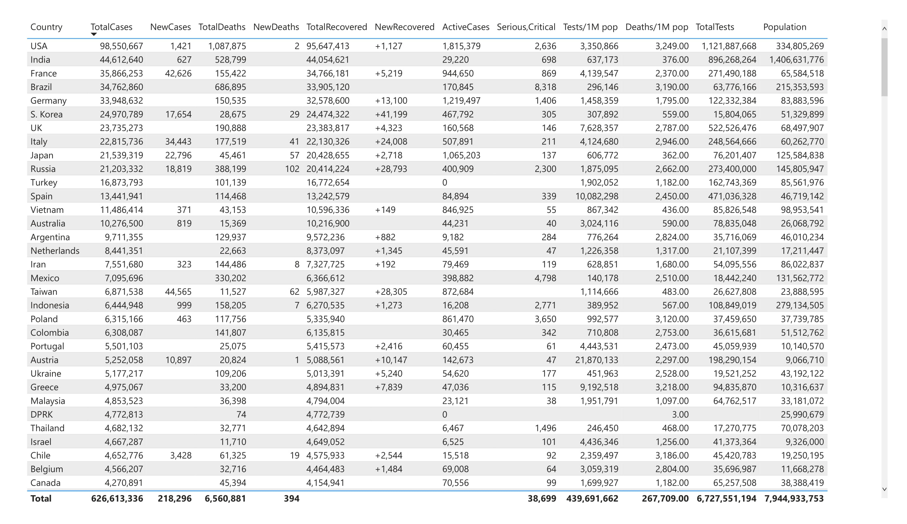
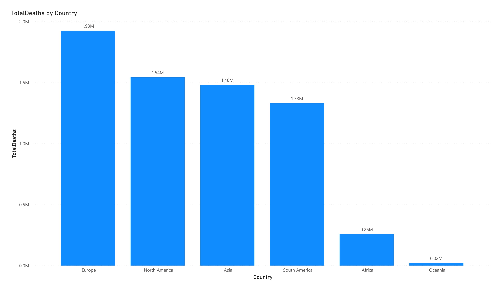
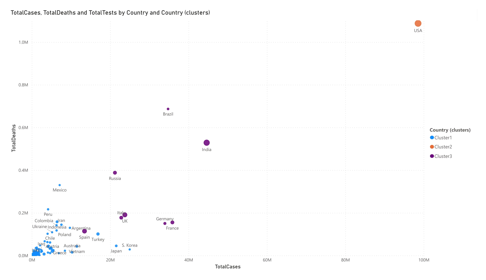
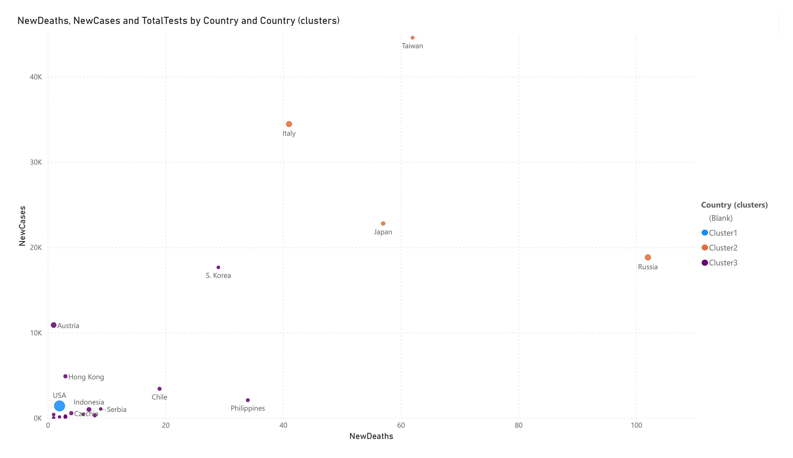

# Web-Scraping-CoronaVirus-Cases
- Scraping data for Reported COVID-19 Cases 

- Website: https://www.worldometers.info/coronavirus/

- Visuals are pulled from Power BI

- Europe accounted for 29.35% of Sum of TotalDeaths.

- USA had the highest Sum of TotalCases (98550667) and Sum of TotalDeaths (1087875). The Country (clusters) with the highest Sum of TotalCases and Sum of TotalDeaths was Cluster2.

Most Country were below 2918353 in Sum of TotalCases and below 30791 in Sum of TotalDeaths.
  

- Russia had the highest NewDeaths (102) and Taiwan had the highest NewCases (44565). The Country (clusters) with the highest NewDeaths and NewCases was Cluster2.

Most Country were below 20 in NewDeaths and below 8266 in NewCases.

- Taiwan had the highest NewCases (44565) and Russia had the highest NewDeaths (102). The Country (clusters) with the highest NewCases was Cluster2 and the Country (clusters) with the highest NewDeaths was Cluster3.

Most Country were below 8266 in NewCases and below 20 in NewDeaths.

  


